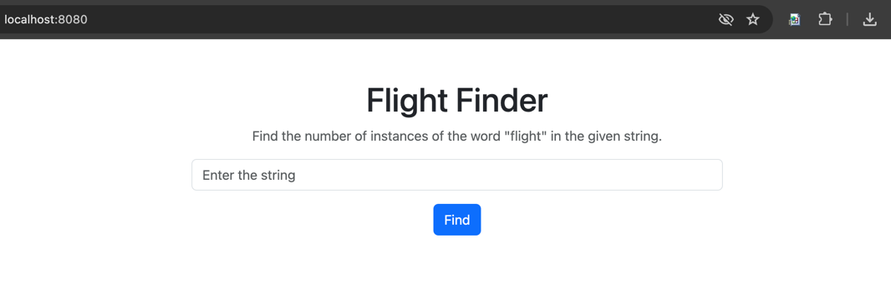

# Flight Finder

## Overview

The Flight Finder is a simple web application allows users to determine the instances of the word “flight” in the given word. 


## Prerequisites

- Java 17 or higher
- Maven

## Setup and Installation

1. **Clone the Repository**:
   ```bash
   git clone https://github.com/Chuhaa/flight-finder
   cd flight-finder
   ```

2. **Build the Project**:
   ```bash
   mvn clean install
   ```

3. **Run the application**:
   ```bash
   mvn spring-boot:run
   ```

4. **Access the application**:
   Open a web browser and navigate to `http://localhost:8080`.


## Technologies Used

- **Backend**:
    - Spring Boot 3.3.2
    - Java 17

- **Frontend**:
  - JavaScript
  - HTML, CSS
  - Bootstrap 5.3.3

# Notes
- Validations are handled in both the frontend and backend to ensure the application is robust, user-friendly, and secure.
- Both Controller and Service classes have 100% line test coverage.
